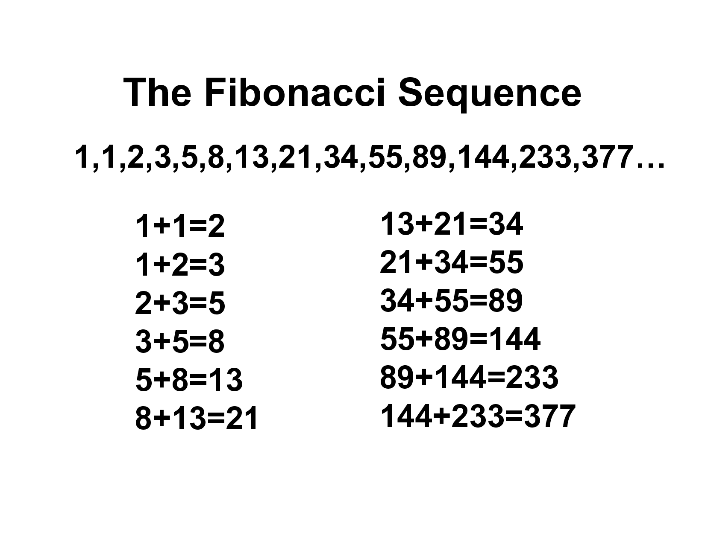

## 알고리즘 스터디 Day 05

#### Date: 2019-10-??

 

## 1. comprehension 가지고 놀기

지난주에 list comprehension에 대해 배우시는 것을 봤습니다. comprehension 문법은 파이썬에 있는 독특한 문법으로, 복잡한 과정 없이 쉽게 자료형을 만들어주는 매우 고마운 문법입니다. 저는 개인적으로 list comphrehension 문법이 흥미로워서 파이썬에 빠져 공부했습니다.

comprehension으로 리스트뿐 아니라 tuple, set 같은 다른 자료형도 만들어 볼 수 있습니다. 이것을 활용해서 까다로울 수 있는 자료형태를 만들어봅시다.

 

* **문제: dict를 만들되, key는 'a'부터 'z', value는 1부터 26까지가 되도록 하라.**

 

:입력: 
:출력: dict | 26개의 쌍을 갖는 dict( `{'a': 1, 'b': 2, 'c': 3, ..., 'y': 25, 'z': 26}` )
:조건:      

1. 이 dict를 어떻게 구현해도 상관없으나, 가급적 쉽게 만들어보실래요? 가능하다면, dict comprehension을 써주시면 좋겠습니다.

제가 짠 코드: [dict comprehension example](https://gist.github.com/shoark7/d086dfc3a4f335370ced5bf5684fd154)

 
 

## 2. fibonacci, I'm gonna watch

이 문제는 알고리즘의 영역이지만 한 번 풀어봐도 괜찮을 것 같아요. **fibonacci(이하 "피보나치") 수열이라고 들어보셨나요? 해당 수가 이전 두 수의 합이 되는 수열로 알고리즘에서는 매우매우 유명한 문제이지요!** 이미지로 확인해보실래요?

**우리는 0번째는 0, 1번째는 1, 2번째부터는 이전 두 수의 합으로 이 수열을 정의하겠습니다.**

 

* **문제: 0 이상의 정수 `nth`이 주어질 때, nth번째 피보나치 수를 반환하는 함수를 만들어라.**

 

:입력: nth  | int := 0 이상, 1000 이하의 정수
:출력: int := **nth번째 피보나치 수. 입력이 0일 때는 0, 1일 때는 1, 그외에는 이전 두 피보나치 수의 합**
:조건:      

제가 짠 코드: [fibonacci](https://gist.github.com/shoark7/152a6991eb60d94c7ab717976aaef863)

 
 

이 문제는 알고리즘의 영역이지만 한 번 풀어봐도 괜찮을 것 같아요. **fibonacci(이하 "피보나치") 수열이라고 들어보셨나요? 해당 수가 이전 두 수의 합이 되는 수열로 알고리즘에서는 매우매우 유명한 문제이지요!** 이미지로 확인해보실래요?

**우리는 0번째는 0, 1번째는 1, 2번째부터는 이전 두 수의 합으로 이 수열을 정의하겠습니다.**

 

* **문제: 0 이상의 정수 `nth`이 주어질 때, nth번째 피보나치 수를 반환하는 함수를 만들어라.**

 

:입력: nth  | int := 0 이상, 1000 이하의 정수
:출력: int := **nth번째 피보나치 수. 입력이 0일 때는 0, 1일 때는 1, 그외에는 이전 두 피보나치 수의 합**
:조건:      

제가 짠 코드: [fibonacci](https://gist.github.com/shoark7/152a6991eb60d94c7ab717976aaef863)

 
 
